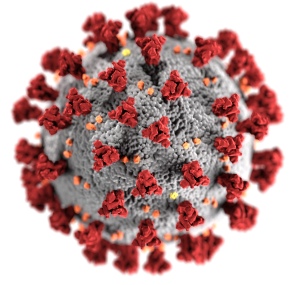

# [COVID19 US Specific Dashboard](https://ncov19.us/)

## About this app
Visualizing COVID19 pandemic in the U.S. by states and by the whole country, with newsfeeds from major news channels and twitter feeds from public officials and institutions. The app can be [found here](https://ncov19.us/).

## Tech Stack
- Plotly Dash
- Flask

## Architecture

# Data Sources

- [Johns Hopkins CSSE](https://github.com/CSSEGISandData/COVID-19)
- State & Local Govs.
- Twitter API
- News API

## Contributors

| [Harsh Desai](https://github.com/hurshd0)     | [Elizabeth Ter Sahakyan](https://github.com/elizabethts) | [Han Lee](https://github.com/leehanchung) |[Anisha Sunkerneni](https://github.com/ars394) | [Michael Chrupcala](https://github.com/mchrupcala) | [Daniel Firpo](https://github.com/Turtled) |
| :--------------------: | :--------------------: | :--------------------: | :--------------------: | :--------------------: | :--------------------: | 
|  |  |  |  |  |  | 
| Data Scientist | Data Scientist | Machine Learning Engineer | Web Developer |  Web Developer |  Web Developer |
|                     |     |     |  |   |        
